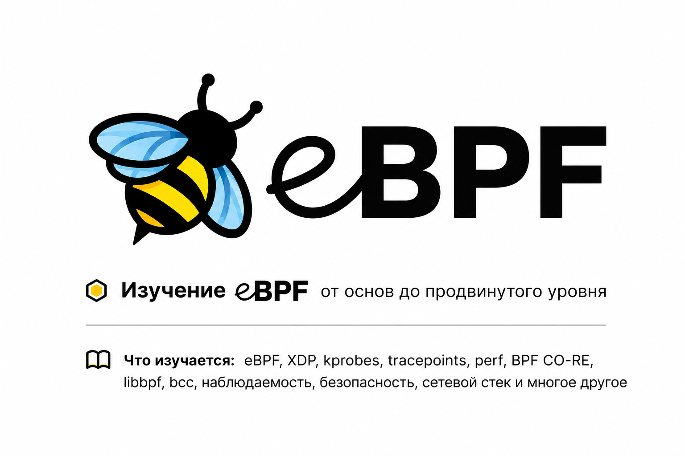

# Learning eBPF



Репозиторий с практическими примерами eBPF для Linux: наблюдаемость, сеть и безопасность на уровне ядра. Примеры разложены по главам и рассчитаны на пошаговое изучение и эксперименты.

**Автор репозитория:** Egor Istomin

Примеры основаны на книге [*Learning eBPF*](https://github.com/lizrice/learning-ebpf) (Liz Rice, O'Reilly). Здесь собран код из репозитория к книге — без рекламы и сторонних магазинов, только материал по eBPF.

## Запуск примеров

В репозитории — eBPF-программы из книги, плюс конфиг [Lima](https://github.com/lima-vm/lima) с уже установленными пакетами для сборки.

Если есть своя Linux-машина или VM, можно обойтись без Lima: ориентируйтесь на `learning-ebpf.yaml` — там перечислены нужные пакеты. Минимальная версия ядра зависит от главы. Все примеры проверялись на Ubuntu 22.04 с ядром 5.15.

### Клонирование

```sh
git clone --recurse-submodules <url-вашего-репозитория>
cd learning-ebpf
```

### Lima VM

```sh
limactl start learning-ebpf.yaml
limactl shell learning-ebpf

# Для большинства примеров нужны права root
sudo -s
```

### Сборка libbpf и заголовков

Libbpf подключён как submodule. Его нужно собрать и установить, чтобы собирались C-примеры (подробнее в `libbpf/README.md`).

```sh
cd libbpf/src
make install
cd ../..
```

### Сборка bpftool

В нескольких главах используется `bpftool`. Чтобы в примерах главы 3 отображался jited-код, нужна сборка с поддержкой libbfd:

```sh
cd ..
git clone --recurse-submodules https://github.com/libbpf/bpftool.git
cd bpftool/src
make install
```

Готовые бинарники также есть в [релизах bpftool](https://github.com/libbpf/bpftool/releases).

## Примеры по главам

Каталоги соответствуют главам книги:

* Глава 1: What Is eBPF and Why Is It Important?
* [Глава 2: eBPF's "Hello World"](chapter2/README.md) — базовые примеры на BCC
* [Глава 3: Anatomy of an eBPF Program](chapter3/README.md) — XDP на C, байткод и машинный код, вызовы BPF → BPF
* [Глава 4: The bpf() System Call](chapter4/README.md) — BCC и уровень syscall
* [Глава 5: CO-RE, BTF and Libbpf](chapter5/README.md) — примеры на libbpf (C)
* [Глава 6: The eBPF Verifier](chapter6/README.md) — правки кода и ошибки верификатора
* [Глава 7: eBPF Program and Attachment Types](chapter7/README.md) — разные типы программ
* [Глава 8: eBPF for Networking](chapter8/README.md) — хуки в сетевом стеке (ping, curl)
* [Глава 9: eBPF for Security](chapter9/README.md) — LSM API
* [Глава 10: eBPF Programming](chapter10/README.md) — обзор eBPF-библиотек
* Глава 11: The Future Evolution of eBPF

Для глав 1 и 11 отдельного кода нет.

### Привилегии

Для загрузки BPF-программ в ядро нужны root или `CAP_BPF` и [дополнительные capabilities](https://mdaverde.com/posts/cap-bpf/). Обычно хватает `sudo -s`.

### Вывод trace из eBPF

* `cat /sys/kernel/debug/tracing/trace_pipe`
* `bpftool prog tracelog`

## Другие дистрибутивы Linux

Примеры тестировались на Ubuntu 22.04 и ядре 5.15. На других дистрибутивах или версиях ядра возможны несовместимости пакетов. Например, при Clang 15+ (`clang --version`) нужен [BCC 0.27.0](https://github.com/iovisor/bcc/releases) или новее.

## Замечания и правки

Нашли ошибку в примере или хотите улучшить README — открывайте issue или присылайте pull request.
